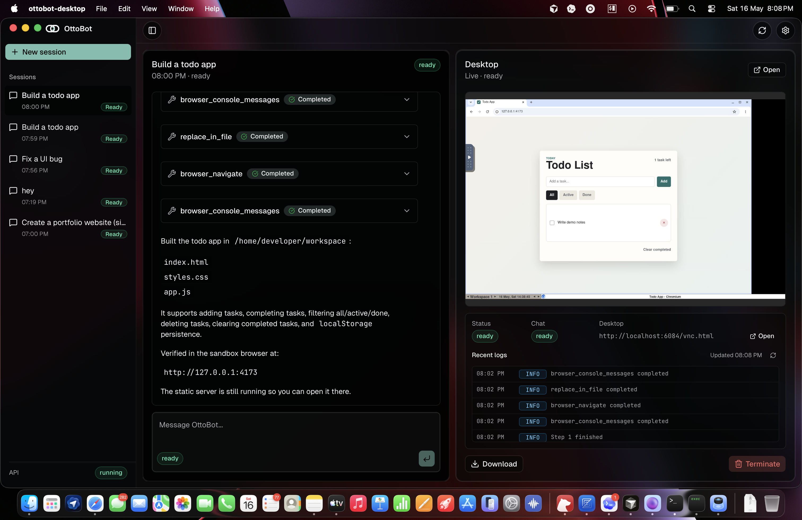
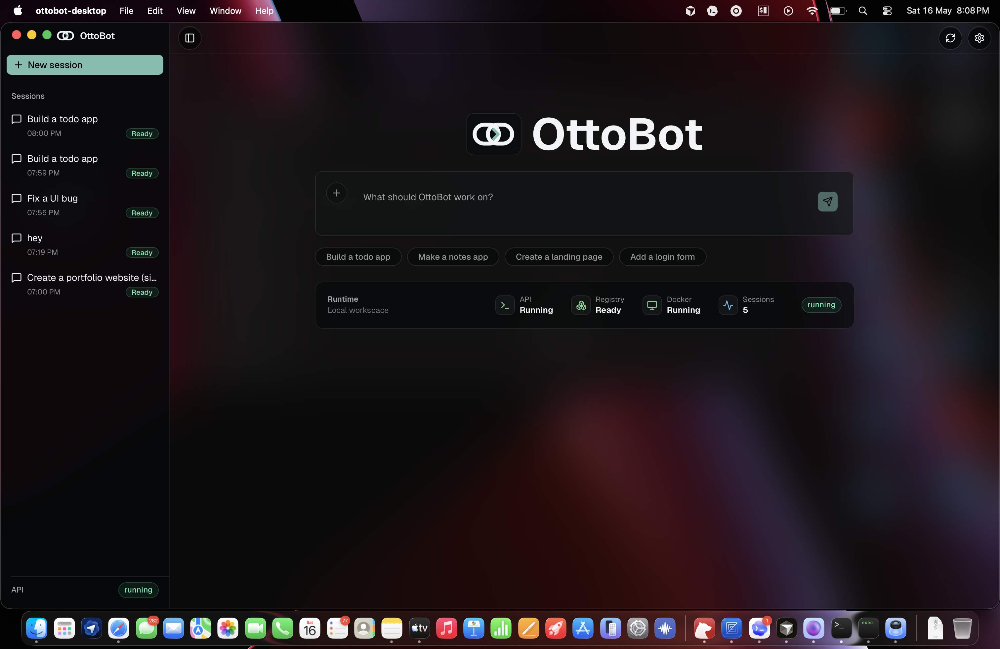
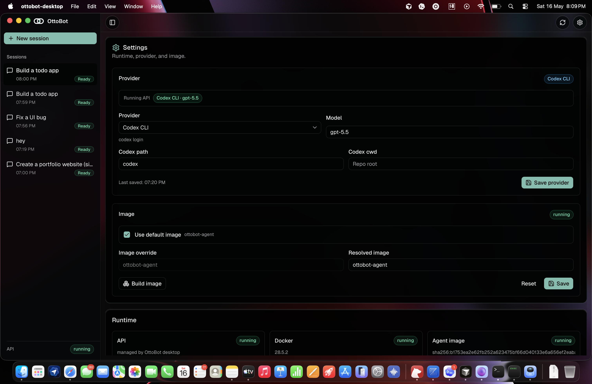

# OttoBot

OttoBot is a local-first Tauri desktop cockpit for running coding-agent sessions in Docker sandboxes. The desktop app supervises a local Elysia API, the API owns session/container lifecycle directly, and SQLite stores session state on disk.

<p align="center">
  
</p>

<p align="center">
  
  
</p>

## Runtime

```text
Tauri desktop -> Elysia API -> SQLite registry
                          -> Docker sandbox container
                          -> AI SDK ToolLoopAgent -> MCP server in container
```

There is no Redis queue, BullMQ worker, or separate background process. Session creation, chat streaming, registry writes, container cleanup, and agent lifecycle all run in the local API process supervised by Tauri.

## Stack

- Bun + TypeScript
- Elysia HTTP API with AI SDK UI streams
- Tauri 2 desktop shell
- React, Vite, Tailwind, and shadcn-style UI in `frontend/`
- SQLite session registry at `session-data/ottobot.sqlite`
- Docker agent image with noVNC, Playwright browser tools, desktop control, shell, and workspace MCP tools

## Quick Start

```bash
bun install
cp .env.example .env
bun run docker:agent
bun run dev
```

Docker must be running, and the agent image must exist before session creation works. Provide at least one model path through `OPENAI_API_KEY`, `GEMINI_API_KEY`, `ANTHROPIC_API_KEY`, or `codex login`.

## Useful Commands

```bash
bun run dev:api
bun run dev:web
bun run typecheck
bun run check:frontend
bun run desktop:check
bun run build
```

Frontend-only commands can also run from `frontend/`:

```bash
bun run check
bun run build
bun run dev
```

## Configuration

Important environment values:

- `LLM_PROVIDER` and `LLM_MODEL`
- `CODEX_CLI_PATH` and `CODEX_CLI_CWD` when `LLM_PROVIDER=codex-cli`
- `AI_AGENT_MAX_STEPS`
- `OTTOBOT_SQLITE_PATH`
- `AGENT_IMAGE`
- `VNC_PORT_RANGE_START` / `VNC_PORT_RANGE_END`
- `MCP_PORT_RANGE_START` / `MCP_PORT_RANGE_END`

The desktop Settings tab persists provider/model/image choices for desktop-managed API starts. Manual `bun run dev:api` runs still use the shell environment.

## API Surface

- `POST /session` creates a sandbox session.
- `GET /session` lists sessions.
- `GET /session/:id/messages` restores persisted AI SDK UI messages.
- `POST /session/:id/chat` streams chat responses.
- `DELETE /session/:id` terminates and cleans up a session.
- `GET /session/:id/logs` returns recent session logs.
- `GET /download/:id` downloads the session workspace.
- `GET /health` and `GET /health/metrics` report runtime health.

## Verification

```bash
bun run typecheck
cd frontend && bun run check && bun run build
bun run desktop:check
```

Container/session behavior is only verified when Docker is running, `ottobot-agent` exists, and a session can create a Docker sandbox.
