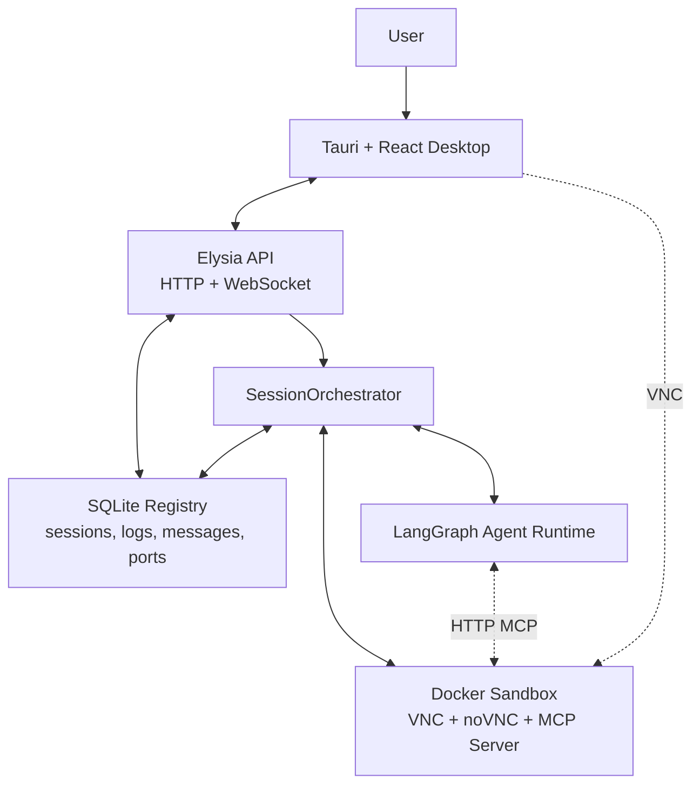
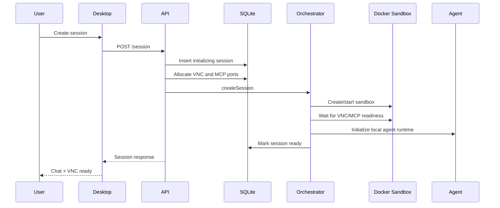
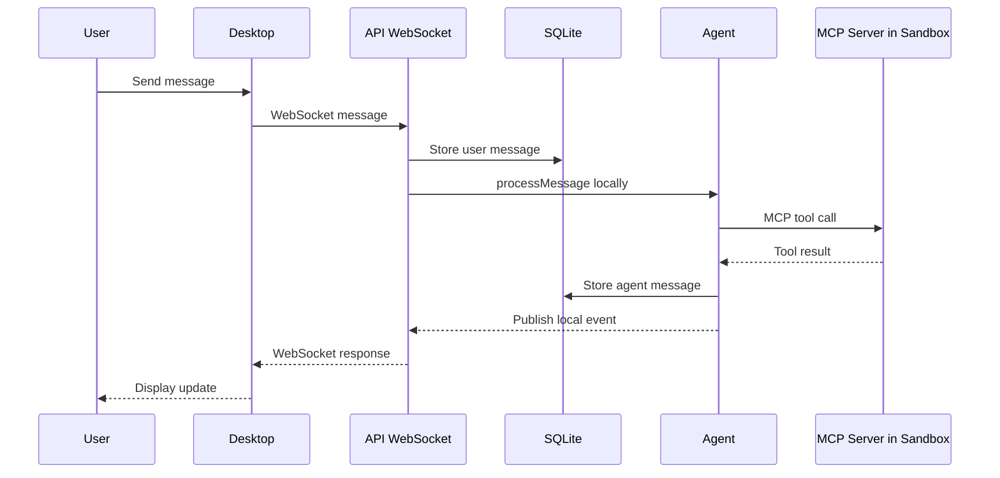

# OttoBot Architecture - Mermaid Diagrams

## Current Architecture

```mermaid
graph TB
    User[User]
    Frontend[Tauri + React Desktop]
    API[Elysia API<br/>HTTP + WebSocket]
    Registry[SQLite Registry<br/>sessions, logs, messages, ports]
    Orchestrator[SessionOrchestrator]
    Agent[LangGraph Agent Runtime]
    Sandbox[Docker Sandbox<br/>VNC + noVNC + MCP Server]

    User --> Frontend
    Frontend <--> API
    API <--> Registry
    API --> Orchestrator
    Orchestrator <--> Registry
    Orchestrator <--> Sandbox
    Orchestrator <--> Agent
    Agent <-. HTTP MCP .-> Sandbox
    Frontend -. VNC .-> Sandbox
```

## Session Creation Flow

```mermaid
sequenceDiagram
    participant U as User
    participant F as Desktop
    participant A as API
    participant D as SQLite
    participant O as Orchestrator
    participant C as Docker Sandbox
    participant G as Agent

    U->>F: Create session
    F->>A: POST /session
    A->>D: Insert initializing session
    A->>D: Allocate VNC and MCP ports
    A->>O: createSession
    O->>C: Create/start sandbox
    O->>C: Wait for VNC/MCP readiness
    O->>G: Initialize local agent runtime
    O->>D: Mark session ready
    A-->>F: Session response
    F-->>U: Chat + VNC ready
```

## Chat Flow

```mermaid
sequenceDiagram
    participant U as User
    participant F as Desktop
    participant A as API WebSocket
    participant D as SQLite
    participant G as Agent
    participant C as MCP Server in Sandbox

    U->>F: Send message
    F->>A: WebSocket message
    A->>D: Store user message
    A->>G: processMessage locally
    G->>C: MCP tool call
    C-->>G: Tool result
    G->>D: Store agent message
    G-->>A: Publish local event
    A-->>F: WebSocket response
    F-->>U: Display update
```
