# OttoBot Architecture - Mermaid Diagrams

## Current Architecture (v1.0) - Agent Runtime in Workers

```mermaid
graph TB
    %% User Layer
    User[👤 User]
    Frontend[🖥️ Frontend<br/>SvelteKit<br/>- Dashboard<br/>- Session UI<br/>- VNC Viewer]
    
    %% API Layer
    API[⚡ API Server<br/>Elysia<br/>- HTTP/WS APIs<br/>- Session Mgmt<br/>- Auth/CORS]
    
    %% Redis Layer
    Redis[📊 Redis Layer<br/>- Session State<br/>- Job Queue BullMQ<br/>- Pub/Sub Routing<br/>- Port Allocation]
    
    %% Worker Layer (Current)
    Worker1[🔧 Worker Process 1<br/>v1.0 Current<br/>- Container Management<br/>- 🧠 Agent Runtime<br/>- MCP Client<br/>- Resource Allocation]
    Worker2[🔧 Worker Process 2<br/>v1.0 Current<br/>- Container Management<br/>- 🧠 Agent Runtime<br/>- MCP Client<br/>- Resource Allocation]
    WorkerN[🔧 Worker Process N<br/>v1.0 Current<br/>- Container Management<br/>- 🧠 Agent Runtime<br/>- MCP Client<br/>- Resource Allocation]
    
    %% Container Layer
    Container1[🐳 Container 1<br/>- Ubuntu + XFCE<br/>- VNC 6080-6200<br/>- 🔗 MCP Server 8080-8200<br/>- VS Code + Dev Tools]
    Container2[🐳 Container 2<br/>- Ubuntu + XFCE<br/>- VNC 6080-6200<br/>- 🔗 MCP Server 8080-8200<br/>- VS Code + Dev Tools]
    ContainerN[🐳 Container N<br/>- Ubuntu + XFCE<br/>- VNC 6080-6200<br/>- 🔗 MCP Server 8080-8200<br/>- VS Code + Dev Tools]
    
    %% Connections
    User --> Frontend
    Frontend <--> API
    API <--> Redis
    Redis --> Worker1
    Redis --> Worker2  
    Redis --> WorkerN
    Worker1 <--> Container1
    Worker2 <--> Container2
    WorkerN <--> ContainerN
    
    %% VNC Direct Access
    Frontend -.-> Container1
    Frontend -.-> Container2
    Frontend -.-> ContainerN
    
    %% MCP Protocol
    Worker1 <-.-> Container1
    Worker2 <-.-> Container2
    WorkerN <-.-> ContainerN
    
    %% Styling
    classDef userLayer fill:#e3f2fd
    classDef apiLayer fill:#f3e5f5
    classDef redisLayer fill:#fff3e0
    classDef workerLayer fill:#e8f5e8
    classDef containerLayer fill:#fce4ec
    classDef current fill:#bbdefb
    
    class User,Frontend userLayer
    class API apiLayer
    class Redis redisLayer
    class Worker1,Worker2,WorkerN workerLayer
    class Container1,Container2,ContainerN containerLayer
```

## Future Architecture (v2.0) - Dedicated Agent Runtime Pool

```mermaid
graph TB
    %% User Layer
    User[👤 User]
    Frontend[🖥️ Frontend<br/>SvelteKit<br/>- Dashboard<br/>- Session UI<br/>- VNC Viewer]
    
    %% API Layer
    API[⚡ API Server<br/>Elysia<br/>- HTTP/WS APIs<br/>- Session Mgmt<br/>- Auth/CORS]
    
    %% Redis Layer (Enhanced)
    Redis[📊 Redis Layer<br/>- Session State<br/>- Job Queue BullMQ<br/>- Pub/Sub Routing<br/>- Port Allocation<br/>- Agent Pool Management]
    
    %% Worker Layer (Future - Infrastructure Only)
    Worker1[🔧 Worker Process 1<br/>v2.0 Future<br/>- Container Management<br/>- Resource Monitoring<br/>- Infrastructure Tasks<br/>- Health Monitoring]
    Worker2[🔧 Worker Process 2<br/>v2.0 Future<br/>- Container Management<br/>- Resource Monitoring<br/>- Infrastructure Tasks<br/>- Health Monitoring]
    WorkerN[🔧 Worker Process N<br/>v2.0 Future<br/>- Container Management<br/>- Resource Monitoring<br/>- Infrastructure Tasks<br/>- Health Monitoring]
    
    %% Agent Pool Layer (Future)
    AgentLB[⚖️ Agent Load Balancer<br/>- Agent Pool Management<br/>- Session Assignment<br/>- Health Monitoring<br/>- Auto-scaling]
    Agent1[🧠 Agent Runtime 1<br/>- LangGraph Agent<br/>- MCP Client<br/>- Context Management]
    Agent2[🧠 Agent Runtime 2<br/>- LangGraph Agent<br/>- MCP Client<br/>- Context Management]
    AgentN[🧠 Agent Runtime N<br/>- LangGraph Agent<br/>- MCP Client<br/>- Context Management]
    
    %% Container Layer
    Container1[🐳 Container 1<br/>- Ubuntu + XFCE<br/>- VNC 6080-6200<br/>- 🔗 MCP Server 8080-8200<br/>- VS Code + Dev Tools]
    Container2[🐳 Container 2<br/>- Ubuntu + XFCE<br/>- VNC 6080-6200<br/>- 🔗 MCP Server 8080-8200<br/>- VS Code + Dev Tools]
    ContainerN[🐳 Container N<br/>- Ubuntu + XFCE<br/>- VNC 6080-6200<br/>- 🔗 MCP Server 8080-8200<br/>- VS Code + Dev Tools]
    
    %% Connections
    User --> Frontend
    Frontend <--> API
    API <--> Redis
    Redis --> Worker1
    Redis --> Worker2  
    Redis --> WorkerN
    Redis <--> AgentLB
    AgentLB --> Agent1
    AgentLB --> Agent2
    AgentLB --> AgentN
    Worker1 <--> Container1
    Worker2 <--> Container2
    WorkerN <--> ContainerN
    
    %% Agent to Container MCP
    Agent1 <-.-> Container1
    Agent2 <-.-> Container2
    AgentN <-.-> ContainerN
    
    %% VNC Direct Access
    Frontend -.-> Container1
    Frontend -.-> Container2
    Frontend -.-> ContainerN
    
    %% Styling
    classDef userLayer fill:#e3f2fd
    classDef apiLayer fill:#f3e5f5
    classDef redisLayer fill:#fff3e0
    classDef workerLayer fill:#e8f5e8
    classDef agentLayer fill:#f0fdfa
    classDef containerLayer fill:#fce4ec
    classDef future fill:#c8e6c9
    
    class User,Frontend userLayer
    class API apiLayer
    class Redis redisLayer
    class Worker1,Worker2,WorkerN workerLayer
    class AgentLB,Agent1,Agent2,AgentN agentLayer
    class Container1,Container2,ContainerN containerLayer
```

## Data Flow Diagram

*Note: These Mermaid diagrams provide a visual representation of the OttoBot architecture. They show the current implementation with agent runtime embedded in workers (v1.0) and the future architecture with dedicated agent runtime pools (v2.0).*